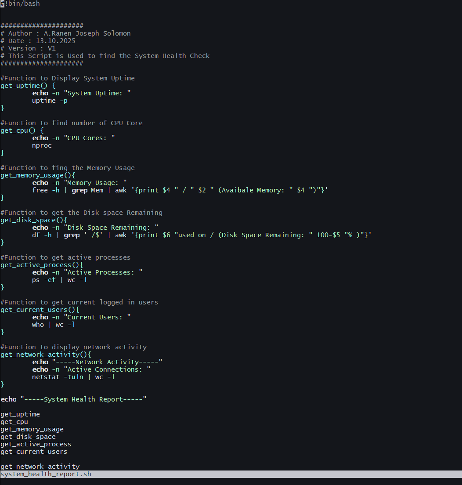
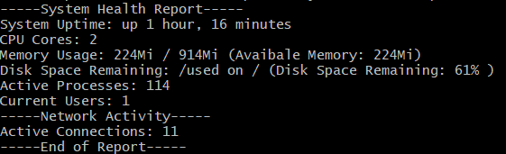

# System_Health_Monitoring_Shell_Script

A simple Bash script designed to monitor various aspects of your system’s health, including system uptime, memory usage, disk usage, active processes, network activity, and the number of current logged-in users. This script is useful for administrators or users who want to get a quick overview of the system's performance and health.

## Features

This script performs several health checks on your system:

- **System Uptime**: Displays how long the system has been running since the last reboot.
- **CPU Cores**: Reports the number of CPU cores available on the system.
- **Memory Usage**: Shows the total, used, and available memory in a human-readable format.
- **Disk Space Usage**: Displays the total, used, and remaining disk space for the root filesystem (`/`).
- **Active Processes**: Counts and reports the number of running processes.
- **Current Logged-in Users**: Displays the number of users currently logged into the system.
- **Network Activity**: Displays the number of active network connections.

## Requirements

This script should work on most Linux-based systems and assumes that the following commands are available:

- `uptime`
- `nproc`
- `free`
- `df`
- `ps`
- `who`
- `netstat`

If you are using a minimal Linux distribution, make sure these commands are installed.

## Usage

1. Clone the repository:
```bash
    git clone https://github.com/JoseScript7/System_Health_Monitoring_Shell_Script.git
```

2. Navigate to the project directory:

```
    cd System_Health_Monitoring_Shell_Script
```

3. Make the script executable:

```
    chmod +x system_health_report.sh
```

4. Run the script:

```
    ./system_health_report.sh
```

## Bash Script Written:


## Output



## How the Script Works

The script gathers system health data using common Unix/Linux commands, processes that data, and presents it in a human-readable format. Below is a breakdown of how the script works:

1. **System Uptime (`uptime -p`)**:
   - **`uptime -p`**: This command retrieves the system's uptime in a **human-readable** format (e.g., "up 10 days, 5 hours"). It shows how long the system has been running since the last reboot.

2. **CPU Cores (`nproc`)**:
   - **`nproc`**: This command outputs the number of processing units (CPU cores) available on the system. This value gives an idea of the system’s parallel processing capabilities.

3. **Memory Usage (`free -h`)**:
   - **`free -h`**: This command shows memory usage, including total memory, used memory, and available memory. The `-h` flag makes the output human-readable (e.g., in GB or MB).
   - **`awk`**: The script uses `awk` to filter and format the memory data to show the available memory in a human-readable format (e.g., `2 GB / 8 GB (Available: 6 GB)`).

4. **Disk Space (`df -h`)**:
   - **`df -h`**: The `df` command is used to show disk space usage in a human-readable format (e.g., GB or TB). The script filters the output to focus on the root (`/`) filesystem and provides the used and available disk space.
   - **`awk`**: The script uses `awk` to format the output, showing both the used space and the remaining space.

5. **Active Processes (`ps -ef | wc -l`)**:
   - **`ps -ef`**: This command lists all active processes on the system, including system processes.
   - **`wc -l`**: The output of `ps -ef` is piped to `wc -l`, which counts the number of lines in the output, representing the total number of processes running on the system. The script uses this count to display the number of active processes.

6. **Current Users (`who | wc -l`)**:
   - **`who`**: The `who` command lists all users currently logged into the system.
   - **`wc -l`**: The script pipes the output of `who` to `wc -l` to count the number of logged-in users. This count is displayed as the number of users currently using the system.

7. **Network Activity (`netstat -tuln`)**:
   - **`netstat -tuln`**: This command shows active network connections, including TCP and UDP connections. The `-tuln` flags filter the output to show only listening sockets (`-l`) and numeric addresses (`-n`), along with the protocol used (`-t` for TCP, `-u` for UDP).
   - **`wc -l`**: The script counts the number of active network connections by piping the `netstat` output to `wc -l`.

### **Script Flow**:

- The script starts by displaying the heading `----- System Health Report -----`.
- Each function is called sequentially to gather the system health information.
- The results are then printed in a human-readable format, showing key system metrics such as uptime, CPU cores, memory usage, disk space, active processes, logged-in users, and network activity.
- Finally, the script ends with `----- End of Report -----` to signify the conclusion of the report.

This design allows the user to quickly assess the overall health of the system and understand its resource usage, helping to troubleshoot potential issues or plan for system maintenance.

## Contributions

Feel free to contribute to this project in the following ways:

- **Fork the repository**: Create a personal copy of the repository and make changes that you think could improve the script.
- **Report issues**: If you find bugs or problems with the script, please create an issue in the repository with a description of the problem and how to reproduce it.
- **Suggest features**: If you have ideas for new features or improvements to the script, feel free to open an issue or create a pull request.
- **Submit pull requests**: If you've fixed a bug or added a new feature, please submit a pull request.